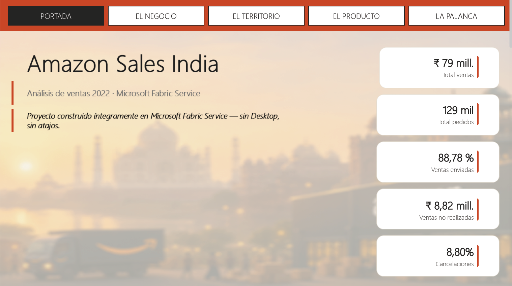

# Amazon Sales India — Microsoft Fabric

> **Proyecto construido íntegramente en Microsoft Fabric Service — sin Power BI Desktop, sin atajos.**


Análisis end-to-end de las ventas de ropa de Amazon en India durante el **Q2 de 2022** (marzo–junio): **129K pedidos** y **₹78,59M** de demanda. Todo el ciclo —ingesta, modelado dimensional, semántica y visualización— está resuelto dentro de **Microsoft Fabric Service**, usando **Direct Lake** para servir el modelo directamente sobre el Lakehouse sin importación de datos.

<!-- Sustituye por la captura real una vez subida a /docs -->


> 📄 *Este README sigue la estructura narrativa **PPHRI** (Problema · Proceso · Herramienta · Resultado · Impacto).*

---

## 📌 El hallazgo que define el proyecto

A primera vista, los datos contaban una historia alarmante: de los **₹78,59M** demandados, solo **₹50,32M** figuraban como *enviados*. Parecía que **se perdían ₹28M (un 36%) antes de llegar al cliente**.

No cuadraba con una tasa de cancelación del 8,8%. Investigando el detalle por canal apareció la causa:

> **Amazon y Merchant usan vocabularios de estado distintos.** En *fulfilment* de Amazon (FBA), el pedido se queda etiquetado como **"Shipped"** aunque Amazon complete la última milla; Merchant, vía Easy Ship, sí actualiza a **"Delivered"**. No son dos fases de un mismo pedido: son **pedidos distintos de canales distintos** que marcan el éxito con palabras distintas.

La medida original solo contaba `"Shipped"` (Amazon) y dejaba fuera **₹18,65M de pedidos Merchant que sí estaban entregados**. Una vez normalizados ambos vocabularios:

| Lectura | Realización | Fuga real |
|---|---|---|
| ❌ Comparación en crudo | ~64% | ₹28M |
| ✅ Vocabularios normalizados | **88,78%** | **₹8,82M** |

El negocio no pierde un tercio de su ingreso: **realiza el ~89% de la demanda**, y la fuga real (~11%) es de **₹8,82M**, concentrada en cancelaciones. Este es el tipo de diferencia entre *construir un dashboard* y *entender el dato*.

---

## 🎯 Problema

El negocio operaba sin visibilidad sobre **qué categorías, qué estados y qué períodos** impulsaban o frenaban las ventas, ni sobre **cuánta demanda se convertía realmente en ingreso entregado**. Sin esa lectura, cualquier conversación sobre cancelaciones, devoluciones o rendimiento por canal partía de cifras crudas y engañosas.

**Preguntas de negocio que resuelve el report:**
- ¿Qué porcentaje de la demanda llega de verdad al cliente, y dónde se fuga el resto?
- ¿Dónde se concentra el ingreso y dónde el riesgo, geográficamente?
- ¿Qué productos y tallas mueven el valor, y cuáles concentran cancelaciones?
- ¿Qué canal de *fulfilment* convierte mejor la demanda en entrega?

---

## 🏗️ Proceso

Pipeline analítico de extremo a extremo, todo dentro del Service:

```
CSV (Kaggle)
   │
   ▼
🪨 Lakehouse  ──────  ingesta del fichero crudo
   │
   ▼
🐍 Notebooks PySpark  ──  limpieza · tipado de fechas (DateConverted) ·
   │                       normalización de estados (StatusFamilia) ·
   │                       zonificación geográfica (Zona) · modelo en estrella
   ▼
🧠 Semantic Model (Direct Lake)  ──  relaciones, medidas DAX, formato
   │
   ▼
📊 Power BI Service  ──────  report de 5 páginas con narrativa de negocio
```

Las dos columnas derivadas clave (`Zona` y `StatusFamilia`) se calculan **aguas arriba en PySpark**, no en el modelo: Direct Lake no admite columnas ni tablas calculadas en DAX, así que toda transformación de fila vive en el Lakehouse y el modelo se queda solo con **medidas y columnas físicas**.

---

## 🧰 Herramienta — por qué *Fabric-native*

La restricción **"sin Desktop, sin atajos"** es deliberada: demuestra dominio del flujo cloud-first que evalúa el **DP-600**.

| Capa | Herramienta | Decisión |
|---|---|---|
| Ingeniería de datos | **Lakehouse + Notebooks PySpark** | Transformación reproducible y versionable, sin pasos manuales |
| Modelado | **Semantic Model en el editor web** | Estrella definida íntegramente en el Service |
| Servicio de datos | **Direct Lake** | Lectura directa sobre Delta, sin importación ni *refresh* programado |
| Visualización | **Power BI Service** | Autoría del report en navegador, sin Desktop |

---

## ⭐ Modelo de datos

Esquema en estrella: una tabla de hechos y cinco dimensiones.

| Tabla | Tipo | Grano / Clave | Columnas destacadas |
|---|---|---|---|
| `amazonsalereport` | **Hechos** | Línea de pedido | `Amount`, `Qty`, `Status`, `Fulfilment`, `Category`, `Size`, `ASIN`, `ship_state`, `B2B`, `Courier_Status`, `DateConverted` |
| `dimdate` | Dimensión | `fecha` | `año`, `mes`, `trimestre` |
| `dimgeografia` | Dimensión | `ship_city` | `ship_state`, `ship_country`, **`Zona`** *(Norte/Sur/Este/Oeste)* |
| `dimproducte` | Dimensión | `ASIN` | `Category`, `Size`, `Style`, `SKU` |
| `dimstatus` | Dimensión | `Status` | **`StatusFamilia`** *(Cancelado/Enviado/Entregado/Pendiente/Devuelto)* |
| `dimfulfilment` | Dimensión | `Fulfilment` | `fulfilled_by` *(Amazon/Merchant)* |

> Las columnas en **negrita** son ingeniería propia creada en PySpark para habilitar la lectura de negocio bajo las restricciones de Direct Lake.

---

## 📐 Medidas DAX

| Medida | Valor | Qué mide |
|---|---|---|
| `Total Ventas` | **₹78,59M** | Importe bruto de toda la demanda |
| `Total Pedidos` | **129K** | Líneas de pedido (≈128.967) |
| `Ticket Medio` | **₹609,36** | Ventas ÷ Pedidos |
| `Ventas Confirmadas` | ₹71,05M | Demanda excluyendo cancelados y pendientes |
| `Ventas Realizadas` | ₹69,77M | Enviado + Entregado *(vocabularios normalizados)* |
| `Ventas Entregadas` | ₹18,65M | Solo estado "Entregado" (canal Merchant) |
| `Ventas No Realizadas` | ₹8,82M | Cancelado + Pendiente + Devuelto |
| **`% Ventas Realizadas`** | **88,78%** | Realizadas ÷ Total — **métrica clave** |
| `% Cancelaciones` | 8,80% | Importe cancelado ÷ Total *(base valor)* |

La medida que resuelve el hallazgo del proyecto, normalizando ambos canales:

```dax
// Cuenta como ingreso realizado lo que llegó al cliente,
// independientemente de si el canal lo marca "Enviado" (Amazon) o "Entregado" (Merchant).
Ventas Realizadas =
CALCULATE (
    [Total Ventas],
    NOT dimstatus[StatusFamilia] IN { "Cancelado", "Pendiente", "Devuelto" }
)

% Ventas Realizadas =
DIVIDE ( [Ventas Realizadas], [Total Ventas] )   // 0,8878

Ventas No Realizadas =
[Total Ventas] - [Ventas Realizadas]             // ≈ ₹8,82M
```

---

## 📊 Resultado — el report (5 páginas)

Narrativa de negocio que fluye de la salud global → al territorio → al producto → a la palanca operativa.

### Portada
5 KPIs de cabecera y la frase diferenciadora. La fotografía del estado del negocio en dos segundos.

### El Negocio — *¿llega la demanda al cliente?*
Embudo demanda → entrega, líneas dobles `Total Ventas` vs realización a lo largo del Q2, y donut de mix por *Fulfilment*. Aquí queda visible la realización del ~89%.


### El Territorio — *¿dónde está el ingreso y dónde el riesgo?*
TOP-10 estados (barras + línea de `% Cancelaciones`), mapa de India por `ship_state`, cuadrante **valor/riesgo** (Ticket Medio × % Cancelaciones, burbuja = ventas) y matriz por `Zona`.


### El Producto — *¿qué vende y qué se cancela?*
Pareto de categorías, **heatmap `Category` × `Size`** de cancelación, combo de tallas y TOP-10 estilos.


### La Palanca — *¿qué canal convierte mejor?*
Comparativa Amazon vs Merchant en realización y cancelación, *scorecard* operativo `StatusFamilia` × `Fulfilment` y ventas no realizadas por canal.


---

## 💡 Insights de negocio

1. **La realización real es del 88,78%, no del 64%.** Tras normalizar los vocabularios de estado, la fuga real es de **₹8,82M (~11%)** y se concentra en **Merchant**, que no realiza ~20% de sus ventas frente al ~7% de Amazon.

2. **El negocio es Pareto.** Dos categorías —**Set** y **Kurta**— concentran **~75%** de las ventas. La diversificación de catálogo no se corresponde con la diversificación del ingreso.

3. **Las tallas extremas cancelan más — problema de *fit*.** En *Bottom*, las tasas de cancelación más altas están en **XL (~14%) y XS (~13%)**, los dos extremos del tallaje; las tallas centrales se comportan mejor. Patrón coherente con un problema de guía de tallas, no de producto.

---

## 🚀 Impacto

- **Diagnóstico corregido:** el problema no era una pérdida del 36% sino una fuga del **~11% (₹8,82M)**, lo que reorienta cualquier plan de acción y evita perseguir un fantasma de ₹28M.
- **Foco por canal:** Merchant triplica la tasa de no realización de Amazon → palanca clara para recuperar ingreso (revisión de cancelaciones y devoluciones del canal).
- **Foco geográfico:** la concentración de ventas en **Sur y Oeste** permite priorizar SLAs de *fulfilment* donde más valor hay en juego.
- **Foco de producto:** la guía de tallas en las tallas extremas reduce cancelaciones en las celdas calientes del heatmap.

---

## 🎨 Sistema de diseño

| Color | Hex | Uso |
|---|---|---|
| Crema | `#f4f1ea` | Fondo de página |
| Terracota | `#c8451f` | Navegación activa, acentos de KPI, énfasis |

**Tipografía:** Segoe UI Light — limpia, neutra y nativa del entorno Microsoft.

Criterio visual: máximo de tinta de datos, mínimo de adorno; cada visual responde a una única pregunta y el color terracota se reserva para guiar la atención, no para decorar.

---

## ▶️ Cómo explorar el report

> ⚠️ **El report interactivo requiere una capacidad de Fabric activa.** Se sirve sobre una **F2 PAYG (Spain Central)** que mantengo **pausada por optimización de costes**. Si el enlace en vivo no carga, es por eso.

- 🔗 **Report en vivo:** *(requiere capacity activa)*
- 📄 **PDF completo del report:** [`./docs/Amazon_Sales_India.pdf`](./docs/Amazon_Sales_India.pdf) — todas las páginas, siempre accesible.

---

## ⚠️ Decisiones, limitaciones y próximos pasos

**Decisiones conscientes**
- `% Cancelaciones` se calcula en **base a importe** (no a recuento), para coherencia con el resto de KPIs monetarios.
- En los datos, **Amazon no registra devoluciones**: es un artefacto de cómo FBA contabiliza los *returns*. Por eso la comparación de devoluciones entre canales no es directa; la comparación robusta entre canales es la de **cancelaciones**.

**Limitaciones**
- El dataset cubre **~Q2 2022** y los meses de los extremos (marzo y junio) parecen **parciales**: la línea temporal debe leerse con cautela y no como estacionalidad anual. Por el mismo motivo, **no hay comparativa YoY**.

**Próximos pasos**
- Incremental refresh y *deployment pipelines* (dev → prod).
- Row-Level Security por `Zona`.
- Alertas sobre `% Ventas Realizadas` por canal.

---

## 📁 Estructura del repositorio

> *Ajusta el árbol a tu organización real de carpetas.*

```
amazon-sales-india-fabric/
├── README.md
├── notebooks/
│   └── 01_ingesta_limpieza_modelo.ipynb
├── dax/
│   └── medidas.dax
└── docs/
    ├── Amazon_Sales_India.pdf
    ├── 01_portada.png
    ├── 02_el_negocio.png
    ├── 03_el_territorio.png
    ├── 04_el_producto.png
    └── 05_la_palanca.png
```

---

## 👤 Sobre el autor

**Carles** — analista de datos en transición hacia *analytics engineering* sobre el stack de Microsoft (Fabric, Direct Lake, DAX).

- 🌐 [carlessales.com](https://carlessales.com)
- 💼 [linkedin.com/in/carlessanchosales](https://linkedin.com/in/carlessanchosales/)
- 🎓 Microsoft Certified: **PL-300** (Power BI Data Analyst)

---

<sub>Dataset: <a href="https://www.kaggle.com/">Amazon Sales Report</a> (Kaggle) · uso educativo y demostrativo. Importes en INR (₹).</sub>


## Autor

**Carles Sancho Sales**
[carlessales.com](https://carlessales.com) · [LinkedIn](https://linkedin.com/in/carlessanchosales/) · [PL-300 Certified](https://learn.microsoft.com/en-us/credentials/certifications/data-analyst-associate/)
